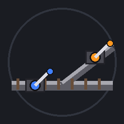

<div align="center">
  
  <h1>Rail Switch 🚂</h1>
  <h3>Ride and switch · Vanilla rails just connect · No mixins · 220 bps tested</h3>
  <p>
    <a href="https://github.com/ResAlexander/rail-switch/releases/latest"></a>
    
    
    <a href="LICENSE"></a>
  </p>
  <p>
    <b>English</b> ·
    <a href="README.zh-CN.md">简体中文</a> ·
    <a href="DEVELOPING.md">Development</a> ·
    <a href="https://github.com/ResAlexander/rail-switch/issues">Issues</a>
  </p>
</div>

**Rail Switch** adds two Y-shaped switch rails to Minecraft Java 26.2 (Fabric). Ride a minecart and hold **Left** or **Right** (default `A` / `D`) before the switch and the cart takes that branch; with no input the cart follows wherever the points currently are. Vanilla rails recognise the block and connect to it automatically.

The mod ships **no mixins** and does not overwrite vanilla minecart methods. It updates switch-rail block states and reads vanilla player-input data; its behavior depends on Minecraft's new minecart physics and rail-state handling. Avoiding mixins removes one common source of conflicts, but does not guarantee compatibility with every rail or physics mod. Compatibility has been tested alongside [highspeed-rail](https://modrinth.com/mod/highspeed-rail) at **220 bps**; other combinations are unverified.  

**Feedback and support:** Sign in to GitHub before creating an [issue](https://github.com/ResAlexander/rail-switch/issues). When signed out, GitHub may show “Issue creation is restricted in this repository.” Commercial-license inquiries can also use the email address on the author's GitHub profile.  

## 🌟 Key Features

<table>
<tr>
<td width="50%" valign="top">

### 🚦 Press to switch

`left_switch_rail` diverges left when the rider holds **Left** (default `A`); `right_switch_rail` diverges right on **Right** (default `D`). An empty cart, a non-player rider or no input never throws the points for that cart — it follows wherever they currently are.

</td>
<td width="50%" valign="top">

### 🔀 Vanilla rails just connect

The block passes vanilla's `isRail` checks and enters the `minecraft:rails` tag, so neighbouring vanilla rails adjust their shape to meet it. It drops like a vanilla rail when its support is broken.

</td>
</tr>
<tr>
<td width="50%" valign="top">

### 🧩 No mixins

No patch to `AbstractMinecart` or `NewMinecartBehavior`. Switching changes the rail block state and lets vanilla's new physics handle the turn; compatibility with other physics mods depends on each mod and should be tested.  

</td>
<td width="50%" valign="top">

### ⚡ High-speed ready

Look-ahead distance scales with cart speed, and a 0.5 s key-memory window lets a long press well before the points still land. Verified alongside highspeed-rail<sup>[1]</sup> at **220 bps**.

</td>
</tr>
<tr>
<td width="50%" valign="top">

### 🛤️ Trailing moves merge

Coming from the branch side, the cart merges into the points end instead of derailing or stopping. Can be configured to stop instead.

</td>
<td width="50%" valign="top">

### 🎛️ Configurable

Six options in `config/rail_switch.json`: look-ahead, key memory, lever sound, legacy-physics behaviour, trailing behaviour, and a debug log.

</td>
</tr>
</table>

## 📦 Quick Start

### Requirements

| Requirement | Detail |
| --- | --- |
| Minecraft | Java Edition **26.2**, Fabric |
| Fabric Loader | `>= 0.19.0` |
| Fabric API | required |
| Java | `>= 25` |
| New minecart physics | **must be enabled** (`minecart_improvements`). Without it the switch degrades to a plain rail and logs one warning. |
| Sides | **client and server both need the mod** |

### Install

**Download** the jar from the [latest release](https://github.com/ResAlexander/rail-switch/releases/latest) — or build it yourself, see [DEVELOPING.md](DEVELOPING.md).

The mod adds blocks, which is *content* — a client without it will see broken blocks. Install the **same version** on both sides:

```text
<profile>/mods/            (client)
├── fabric-api-*.jar
└── rail-switch-1.2.1-fabric-26.2.jar

<server>/mods/             (server, same file)
├── fabric-api-*.jar
└── rail-switch-1.2.1-fabric-26.2.jar
```

* Single player: drop it into your client `mods/` — the integrated server loads it too.
* Server: put it in the server `mods/` and have every player add it to their client `mods/`.
* **Install the mod on the server before loading a world that already contains switch rails**, otherwise those blocks cannot be resolved.

### Place a switch

A switch rail only acts as a switch with **three connected directions**: both ends of the straight track plus one branch end. There is a **Rail Switch** creative tab (v1 ships no crafting recipe).

```text
        north (branch)
        │
  ──────┼──────      straight: east–west
  west  │  east      branch: north
        │
```

## 🎮 Usage

1. Ride a minecart and **hold** Left or Right (default `A` / `D`) before the switch.
2. On a matching switch rail the cart takes that branch; **with no input it follows wherever the points currently are** — the switch does not spring back, it keeps the position it was last thrown to until a cart comes through.
3. There is a 0.5 s (10 tick) memory window after you release — but at speed, **press early**: at 200 bps a cart covers 10 blocks per tick, so hold the key 20–60 blocks ahead.

> The arrow keys are unbound by default, and one action can only have one key. To use them, rebind **Left / Right** in *Options → Controls*; the mod reads the key binding, so rebinding just works.

## ⚙️ Configuration

`config/rail_switch.json` is created on first launch:

| Field | Default | Meaning |
| --- | --- | --- |
| `lookaheadBlocks` | `0` | Look-ahead distance in blocks; `0` = automatic (speed × 2 + 2, clamped to 2–64) |
| `inputMemoryTicks` | `10` | Key memory window in ticks |
| `switchSound` | `true` | Play the lever sound when the points move |
| `requireNewPhysics` | `true` | Disable switching in dimensions without the new minecart physics |
| `trailingBehavior` | `merge` | Approaching from the branch: `merge` into the points end, or `stop` |
| `debugLog` | `false` | Log every set / freeze decision (troubleshooting) |

## 📄 License

This project is licensed under the **PolyForm Noncommercial License 1.0.0** (SPDX identifier `PolyForm-Noncommercial-1.0.0`).

* **The full license text governs**: [`LICENSE`](LICENSE) — official text at <https://polyformproject.org/licenses/noncommercial/1.0.0>. This section is a readable summary, not a modification of, or a substitute for, the license terms.
* **Free for noncommercial use**: personal play, study, research, testing, educational institutions, charities.
* **Commercial use requires a separate license from the author**: open an [issue](https://github.com/ResAlexander/rail-switch/issues), or email the address on the author's GitHub profile.
* **Redistribution duty**: any redistribution must carry the full license text (or its official URL) plus the notice line below.

```text
Required Notice: Copyright (c) 2026 Hardware Alexander (https://github.com/ResAlexander/rail-switch)
```

> This is a source-available license, not an OSI-approved open-source license, so paid servers and paid modpacks are outside the free-use scope.

## 🛠️ Development

Development details live in [DEVELOPING.md](DEVELOPING.md).

---

<sup>[1]</sup> highspeed-rail: <https://modrinth.com/mod/highspeed-rail>

<div align="center">
  <p><sub>NOT AN OFFICIAL MINECRAFT MOD. NOT APPROVED BY OR ASSOCIATED WITH MOJANG OR MICROSOFT.</sub></p>
</div>
